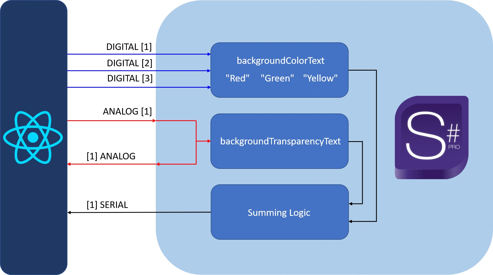
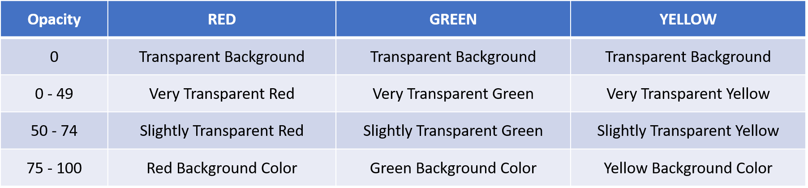

  </img>

## Crestron SIMPL#Pro App

This project is made as a part of the Crestron full-stack tutorial.
In this project, I combined React on frontend, and SIMPL#Pro on the backend, and this project can serve you as a playground for your ideas, and for testing purposes. 
Be aware that I didn't always use the best practices in the tutorial, so have that in mind if you want to use it for a bigger project.

## Build a project

If you want to use that project, you need to build it and upload it to the touch panel. The first step is to build a project in your IDE. If you are using Visual Studio, go to the Build section, and choose Build Solution. It will generate a cpz file, and it will be in your project folder, under ../SimplSharpProApp/bin/Debug/.

## Uploading to the touchscreen

You need to enter the IP address of your processor in the browser. When you enter the page (and you enter your accidentals), if you are using RMC4, you need to go under the Settings section, choose Programs, and under the Programs Slot Management click on the upload button. Follow the upload process and load it to your processor.

## Backend scheme

In the picture bellow, you can see how backend scheme looks like, and how variables are called:

  </img>

## Table of background color text

In the picture bellow, you can see every possible combination of the digital and analog inputs, and how will serial response looks according conditions:

  </img>

